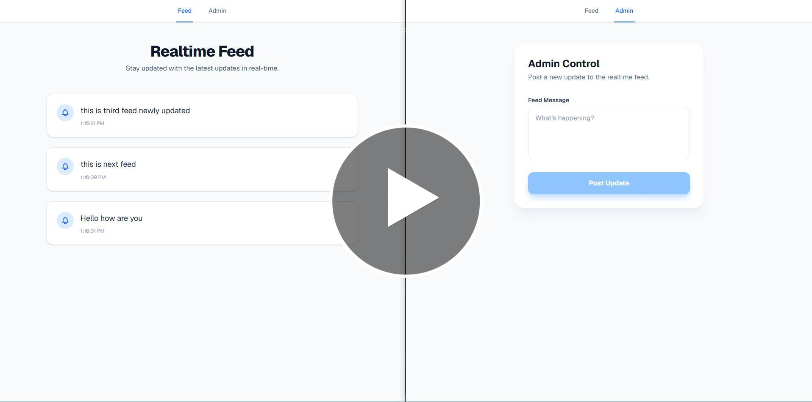

# Realtime Feed Application

A modern, full-stack realtime feed application built with Next.js, Express, Socket.io, MongoDB, and Redis.

## 🌐 Live Demo

Check out the live application here: [https://realtime-feed-app.vercel.app/](https://realtime-feed-app.vercel.app/)

### Video Demo
[](https://share.zight.com/DOuZ7rzj)

## 🚀 Features

- **Realtime Updates**: Instant feed delivery to all connected clients using WebSockets (Socket.io).
- **Admin Dashboard**: Dedicated interface for authorized users to post new updates.
- **Persistent Storage**: MongoDB for storing historical feed data.
- **Caching**: Redis integration for optimized data retrieval.
- **Modern UI**: Responsive design built with Next.js 15, React 19, and Tailwind CSS.

## 🛠️ Tech Stack

### Frontend
- **Framework**: Next.js 15 (App Router)
- **Styling**: Tailwind CSS
- **Realtime**: Socket.io-client
- **Language**: TypeScript

### Backend
- **Server**: Node.js & Express
- **Realtime**: Socket.io
- **Database**: MongoDB (via Mongoose)
- **Caching**: Redis
- **Environment**: dotenv

## 📂 Project Structure

```
realtime-feed-app/
├── backend/            # Express server, Socket.io, MongoDB/Redis config
│   ├── config/         # Database and Redis connections
│   ├── controllers/    # Request handlers
│   ├── models/         # Mongoose schemas
│   └── routes/         # API endpoints
└── frontend/           # Next.js application
    ├── app/            # App router pages and components
    ├── lib/            # Shared utilities (Socket.io client)
    └── public/         # Static assets
```

## ⚙️ Setup & Installation

### Prerequisites
- Node.js (v18+)
- MongoDB (Local or Atlas)
- Redis server

### 1. Backend Setup
1. Navigate to the backend directory:
   ```bash
   cd backend
   ```
2. Install dependencies:
   ```bash
   npm install
   ```
3. Create a `.env` file in the `backend/` directory:
   ```env
   PORT=5000
   MONGO_URI=your_mongodb_connection_string
   REDIS_URL=your_redis_url
   ```
4. Start the development server:
   ```bash
   npm run dev
   ```

### 2. Frontend Setup
1. Navigate to the frontend directory:
   ```bash
   cd frontend
   ```
2. Install dependencies:
   ```bash
   npm install
   ```
3. Update the backend URL in `frontend/lib/socket.ts` and API fetch calls if necessary (default is set for development).
4. Start the development server:
   ```bash
   npm run dev
   ```

## 📖 Usage

- **Main Feed**: Visit `http://localhost:3000` to view the realtime feed.
- **Admin Post**: Visit `http://localhost:3000/admin` to post new updates to the feed.

## 📄 License

This project is licensed under the ISC License.
